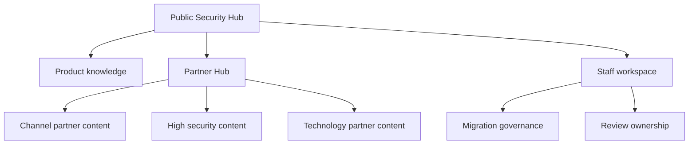

# Recommended architecture

This demo keeps Gallagher Security Hub as one cohesive site, then uses adaptive content for role-specific depth.

## Space model

| Space | Purpose | Default visibility |
| --- | --- | --- |
| Home | Entry point, migration story, plan recommendation | Public |
| Product knowledge | End-user and operator help | Public |
| Partner Hub | Channel, high security, and technology partner overlays | Adaptive |
| Staff workspace | Internal operating model | Adaptive |

## Why this split

- Public product knowledge can be indexed and shared.
- Partner-only material stays close to the related public guidance.
- Technology partner content can sit beside Channel Partner content for visitors who hold both relationships.
- Internal content remains demonstrable without mixing staff-only material into public flows.

